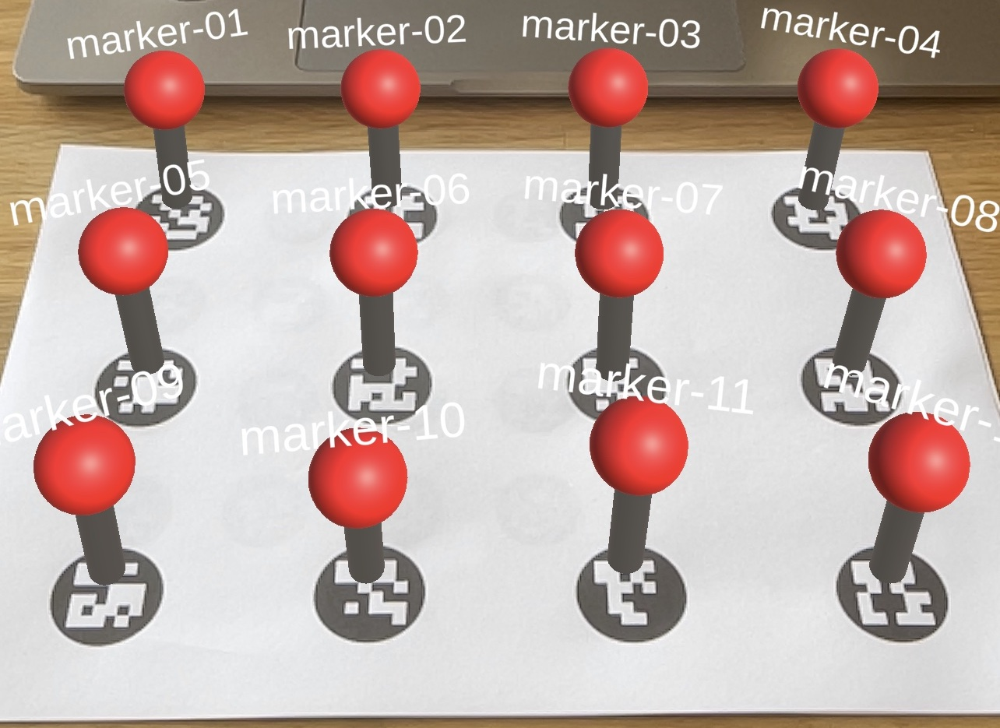

# Simple AR Image Tracking

This is an example Project to showcase how Image Tracking with AR Foundation works in Unity. In order to change the _Tracking Targets_ you have to change the _Image References_ in the _Tracking Library_. Please adjust the physical size of the Images in the Tracking Library if needed. The Image References in the original PDF are 3cm x 3cm each.

### Unity Version

Unity 2022.3.4f1

### Packages

AR Foundation
Apple ARKit XR Plugin

## Locations

**Reference Images**
TrackingImages > MarkerReference.pdf

**Tracking Library**
TrackingLibrary > ReferenceImageLibrary

**xCode Build**
BUILD > Unity-iPhone.xcodeproj _(To run the Build directly please open the xCode Project and change the Provisioning Profile.)_
